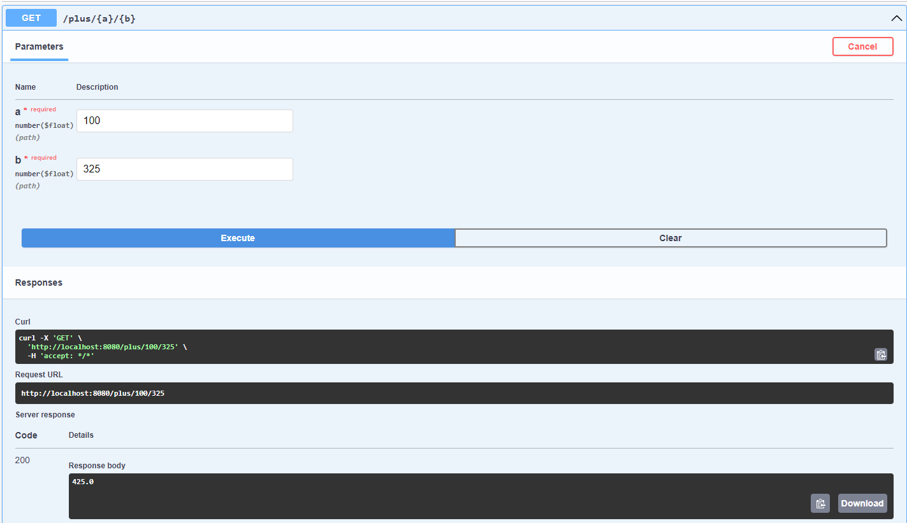
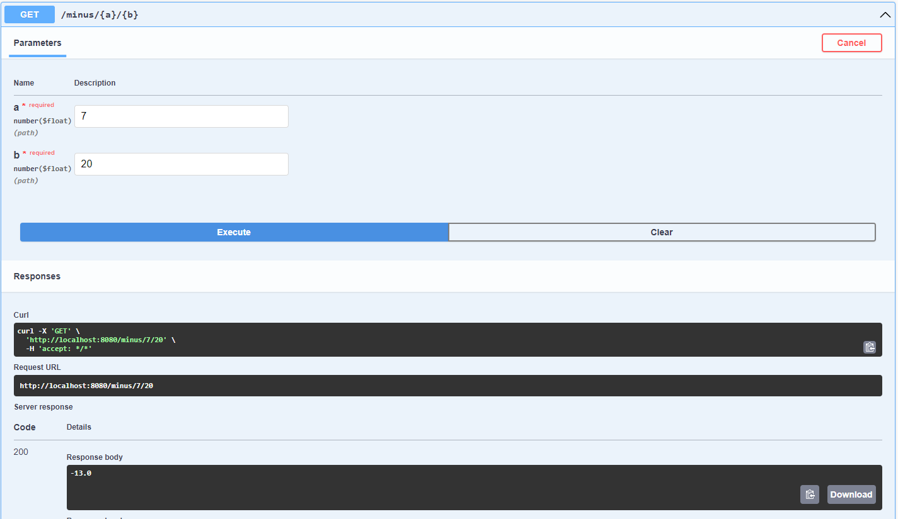
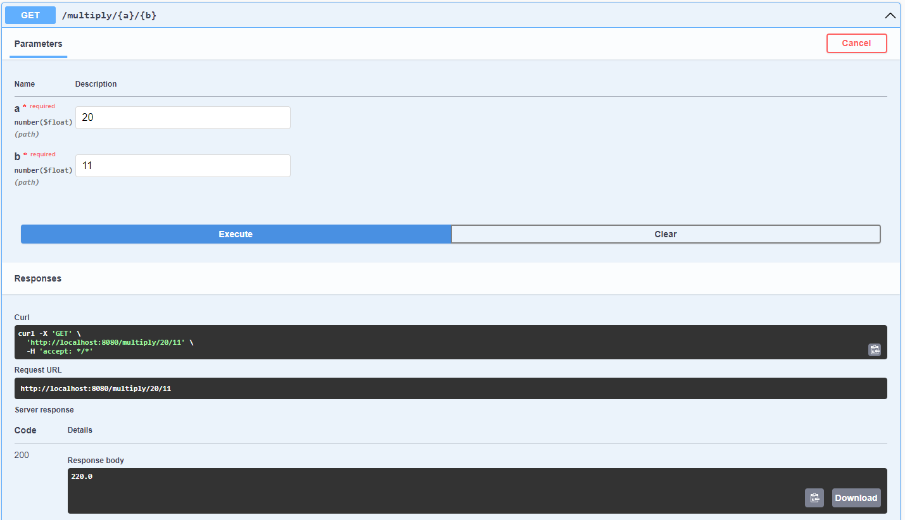
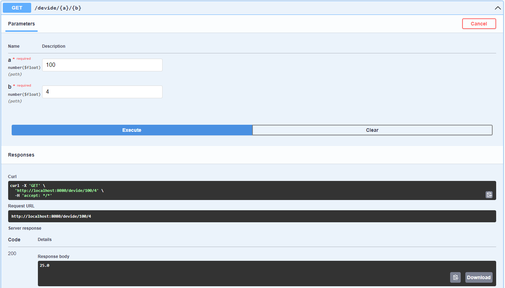
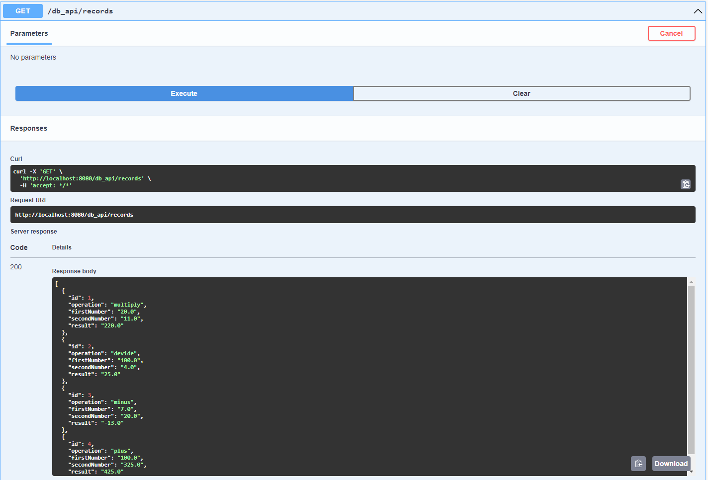

# Screenshots

Calc made during practice for Neoflex

## Fold operation in swagger

Returns the summary of two arguments

## Subtract operation in swagger

Returns the difference between the two arguments

## Multiply operation in swagger

Returns the multiplication of two arguments

## Devide operation in swagger

Returns the deviation between the two arguments

## Get all the operations made from the H2 database

Returns all the operations made

